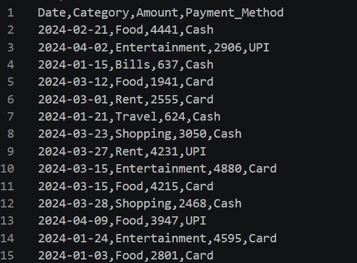
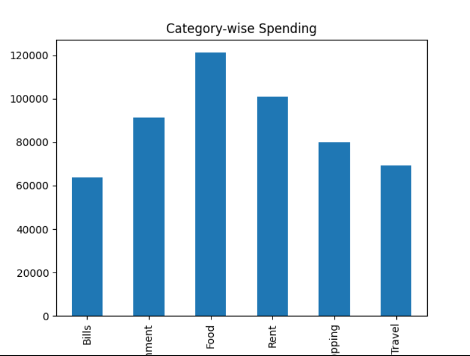
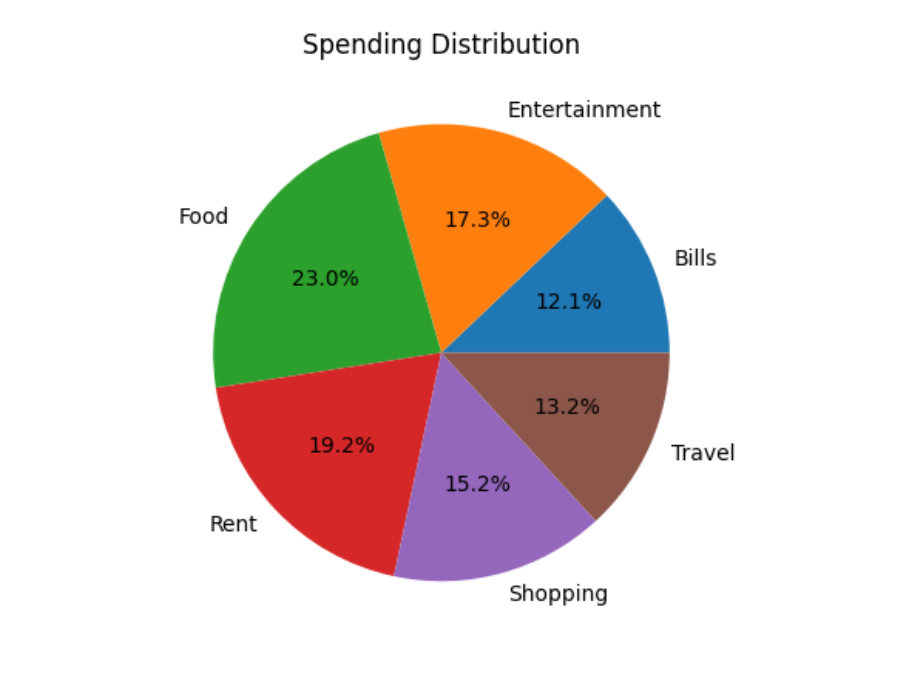
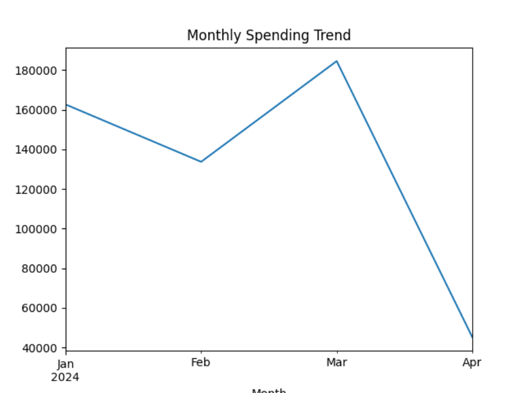
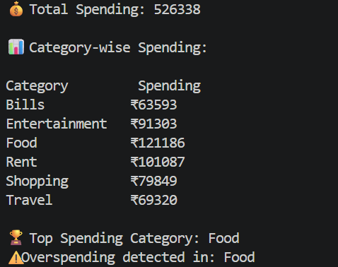

## 💰 Expense Tracker App using Data Science
## 📌 Overview
- The Expense Tracker App is a data-driven project built using Python that helps users track, analyze, and visualize their expenses.
- It provides insights into spending patterns and supports better financial decisions.

## ❗ Problem Statement
Managing personal expenses manually often leads to:
🔻 Issues
- Overspending
- Lack of budgeting
- Poor financial planning

## ✅ Solution
This project uses Data Science techniques to:
🔹 Core Functionalities
- Store expense data in structured format
- Analyze spending patterns using Pandas
- Visualize insights using charts
- Detect overspending categories

## 🚀 Features
📊 Data Handling
- Synthetic dataset generation
- CSV-based storage
📈 Analysis
- Category-wise expense tracking
- Monthly trend analysis
📉 Visualization
- Bar charts
- Pie charts
- Line graphs
- ⚠️ Smart Insights
- Overspending detection

## 🛠 Tech Stack
- 💻 Programming
- Python
- 📚 Libraries
-Pandas
- NumPy
- Matplotlib
- Seaborn

## 📂 Project Structure

```
Expense-Tracker-App/
│
├── data/              
│   └── expenses.csv
│
├── outputs/           
│   ├── category_spending.png
│   ├── pie_chart.png
│   └── monthly_trend.png
│
├── images/            
│   ├── dataset_preview.png
│   ├── category_bar_chart.png
│   ├── pie_chart.png
│   ├── monthly_trend.png
│   └── terminal_output.png
│
├── main.py            
├── requirements.txt   
└── README.md          
```

## ▶️ How to Run
Step 1: Install dependencies
pip install -r requirements.txt

Step 2: Run the project
python main.py


## 📊 Results & Visualizations

### 📌 Dataset Preview


### 📌 Category-wise Spending Chart


### 📌 Spending Distribution


### 📌 Monthly Spending Trend


### 📌 Terminal Output


## 🧠 Key Insights
📍 Observations
- Food is the highest spending category
- Spending varies across months
- Certain categories show overspending trends

## 🔮 Future Improvements
- 🚀 Enhancements
- Streamlit interactive dashboard
- AI-based expense prediction
- Budget alerts system
- Mobile application

## 👩‍💻 Author
Nidhi Apotikar

⭐ Support
If you like this project, give it a ⭐ on GitHub!


